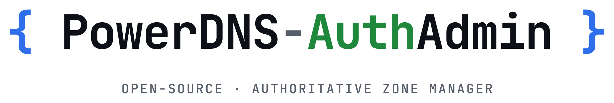

<p align="center">
  <picture>
    <source media="(prefers-color-scheme: dark)" srcset="./media/brand/logo-wordmark-dark.png" />
    
  </picture>
</p>

# powerdns-authadmin.org

[](https://github.com/PowerDNS-AuthAdmin/website/actions/workflows/ci.yml)

Source for **[powerdns-authadmin.org](https://powerdns-authadmin.org)**, the website of
[PowerDNS-AuthAdmin](https://github.com/PowerDNS-AuthAdmin/powerdns-authadmin), a modern,
self-hosted web UI for PowerDNS Authoritative.

The site is plain HTML, CSS and a little vanilla JavaScript, generated by a zero-dependency
Node script. No framework, no `npm install`. The only third-party request is Google Analytics
(see [Analytics](#analytics)).

## Quick start

```sh
node scripts/build.mjs      # → dist/
node scripts/check.mjs      # SEO, links, structured data, CSP
npm run serve               # build + http://127.0.0.1:8080
```

Requires Node 20+. `npm run check` also runs [html-validate](https://html-validate.org) via `npx`.

## Layout

```
src/
  site.mjs            facts used everywhere: version, links, nav  ← bump on each app release
  content.mjs         feature catalog and FAQs (every claim is backed by the app's docs)
  pages/              one module per page (home, features, compare, faq, 404)
  layout.mjs          <head>, SEO + Open Graph, JSON-LD, CSP, header, footer
  styles.css          all styles; dark + light themes via <html data-theme>
  main.js             theme, menu, tabs, copy button, lightbox (progressive enhancement)
  analytics.js        shared NGN GA4 event script (copied verbatim; do not edit or rename events)
  static/             copied verbatim into dist/ (fonts, icons, generated images)
media/                source images: app screenshots and the project's wordmarks
scripts/
  build.mjs           renders pages, sitemap.xml, robots.txt, llms.txt, manifest, security.txt
  check.mjs           static QA gate used by CI and the deploy script
  build-media.mjs     screenshots → WebP, wordmarks, favicons, 1200×630 social cards
  deploy.sh           build, check, rsync, smoke test, IndexNow
  indexnow.mjs        notify Bing / Yandex / Seznam of changed URLs
deploy/
  nginx.conf.example  reference server config (compression, caching, headers, 404)
```

## Common changes

**New app release.** Update `version` and `released` in `src/site.mjs`. The hero pill, footer,
JSON-LD `softwareVersion`, `llms.txt` and `security.txt` expiry all follow.

**Copy.** Edit `src/content.mjs` (features, FAQs) or the page module. Keep claims factual and
sourced from the app's README, docs or changelog. Answers in the FAQ should stand on their own:
answer engines quote them out of context.

**Screenshots.** Copy PNGs from the app repo's `screenshots/{dark,light}/` into
`media/screenshots/`, then regenerate the derived images (needs ImageMagick 7, `cwebp`, `oxipng`
and Chrome or Chromium):

```sh
node scripts/build-media.mjs shots og    # or no argument for everything
```

Generated files under `src/static/assets/` are committed, so a normal build never needs those tools.

**New page.** Add a module under `src/pages/`, register it in `src/pages/index.mjs`, add an `og`
block and run `node scripts/build-media.mjs og`. It joins the sitemap, `llms.txt` and the checks
automatically.

## SEO and answer engines

- Unique title and description per page, canonical URLs, `max-image-preview:large`.
- One JSON-LD graph per page: `Organization`, `WebSite`, `WebPage`, `BreadcrumbList`,
  `SoftwareApplication` + `SoftwareSourceCode` on the home page, `FAQPage` on `/faq/` only.
- `sitemap.xml` with `lastmod` and image entries, `robots.txt`, `llms.txt` for AI crawlers,
  IndexNow key file.
- Per-page 1200×630 social cards, full Open Graph and Twitter tags.
- `robots.txt` allows everything (except the 404 page) and names the AI crawlers explicitly.
- IndexNow key: `652aab60d92521253f92abc06012277a` (served at `/652aab60d92521253f92abc06012277a.txt`,
  set in `src/site.mjs`). `npm run deploy` pings IndexNow after a successful deploy.

## Analytics

GA4 property `G-Y8C640LSFR` (`ga4` in `src/site.mjs`; empty disables it). `src/analytics.js` is the
shared event script used on every NGN-run site, so keep it identical to the others. The build
fingerprints it and every page loads it once with `data-ga4`; it loads gtag.js itself, so there is
no inline script and the CSP in `src/layout.mjs` only needs the Google hosts.

Events: `cta_click` for button-styled links and anything with `data-cta` (the attribute value is the
stable `cta_text`, so keep labels like `Live demo`, `Star on GitHub`, `Docs`, `Installation guide`
consistent across pages), `email_click` for `mailto:` links. `cta_location` is inferred
(header, nav, hero, footer, body); `data-cta-location` overrides it. Outbound clicks to GitHub are
covered by GA4 enhanced measurement. The footer states that the site uses Google Analytics, with
the opt-out link.

After a domain is verified in Google Search Console and Bing Webmaster Tools, submit
`https://powerdns-authadmin.org/sitemap.xml` in both.

## Deploying

Any static host works: serve `dist/` with `404.html` as the not-found page. The reference
[nginx config](deploy/nginx.conf.example) adds compression, long-lived caching for fingerprinted
assets and security headers.

The bundled script deploys over SSH with rsync. The target is read from a git-ignored file:

```sh
cp .env.example .env.deploy   # set DEPLOY_HOST and DEPLOY_PATH
npm run deploy
```

## Contributing

Issues and pull requests are welcome. Please run `npm run check` before opening a PR. For the app
itself, head to [PowerDNS-AuthAdmin/powerdns-authadmin](https://github.com/PowerDNS-AuthAdmin/powerdns-authadmin).

## License

Code: [MIT](LICENSE). Fonts: Inter and JetBrains Mono under the SIL Open Font License
(see `src/static/assets/fonts/`). PowerDNS-AuthAdmin marks and screenshots belong to the
PowerDNS-AuthAdmin project. PowerDNS is a trademark of its respective owner; this is an
independent community project, not affiliated with PowerDNS or Open-Xchange.
